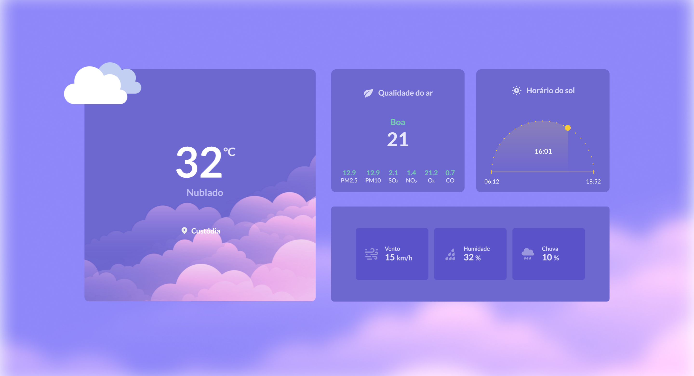

<h1 align="center"> Weather - BoraCodar#10 </h1>

[Clique aqui para acessar](https://maik-emanoel.github.io/weather/)

## 🚀 Tecnologias

Esse projeto foi desenvolvido com as seguintes tecnologias:

- HTML
- CSS
- JavaScript
- Git and GitHub

## 💻 Projeto

Este projeto fornece informações meteorológicas precisas e atualizadas da sua cidade, permitindo que você acompanhe as condições climáticas locais de maneira fácil e conveniente.  
No entanto, devido a falta de algumas informações providas da API que utilizei, as informações sobre qualidade do ar, horário do sol e chances de chuva são apenas ilustrativas e não devem ser usadas para tomadas de decisão críticas.

Obs: Projeto construído a partir do layout proposto no desafio [#BoraCodar10](https://boracodar.dev/) realizado pela [Rocketseat](https://rocketseat.com.br).  
Após a conclusão do deste layout, fiz algumas adições/modifições, tais quais:

- Layout responsivo (se adapta para telas menores)
- Utilização de API para trazer informações do clima
- Mudança no design do layout
- Adição de animação ao entrar na página
- Entre outras mudanças.

## 🔖 Layout

Você pode visualizar o layout do projeto proposto através [DESSE LINK](https://www.figma.com/community/file/1215291914714743267). É necessário ter conta no [Figma](https://figma.com) para acessá-lo.
